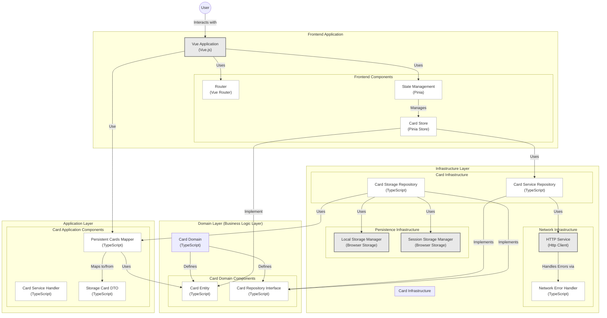

# pockemon-tgc-pocket-stats

This template should help get you started developing with Vue 3 in Vite.

## Recommended IDE Setup

[VSCode](https://code.visualstudio.com/) + [Volar](https://marketplace.visualstudio.com/items?itemName=Vue.volar) (and disable Vetur).

## Type Support for `.vue` Imports in TS

TypeScript cannot handle type information for `.vue` imports by default, so we replace the `tsc` CLI with `vue-tsc` for type checking. In editors, we need [Volar](https://marketplace.visualstudio.com/items?itemName=Vue.volar) to make the TypeScript language service aware of `.vue` types.

## Customize configuration

See [Vite Configuration Reference](https://vite.dev/config/).

## Project Setup

```sh
bun install
```

### Compile and Hot-Reload for Development

```sh
bun dev
```

### Type-Check, Compile and Minify for Production

```sh
bun run build
```

### Run End-to-End Tests with [Playwright](https://playwright.dev)

```sh
# Install browsers for the first run
npx playwright install

# When testing on CI, must build the project first
bun run build

# Runs the end-to-end tests
bun test:e2e
# Runs the tests only on Chromium
bun test:e2e --project=chromium
# Runs the tests of a specific file
bun test:e2e tests/example.spec.ts
# Runs the tests in debug mode
bun test:e2e --debug
```

### Lint with [ESLint](https://eslint.org/)

```sh
bun lint
```

# clean-architecture-vue-3


