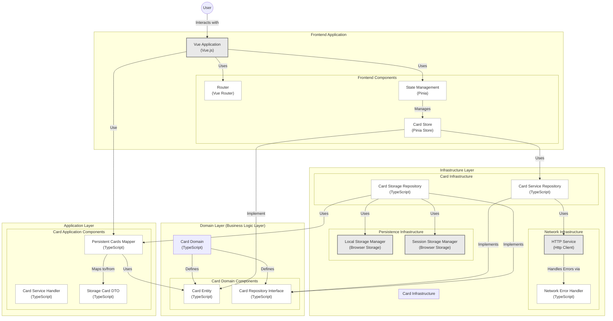

<div align="center">
  <a href="https://buymeacoffee.com/oscarraygoza">
    
  </a>

  <h3 align="center">CLEAN ARCHITECTURE FRONTEND</h3>

  <p align="center">
    <br />
    Una exemplo practico donde utilizamos una arquitectura limpia 
    <br />
    <br />
    <a href="https://medium.com/@oscar.eduardo.raygoza/implementando-clean-architecture-en-el-frontend-una-experiencia-pr%C3%A1ctica-68d1dab575eb"><strong>Explore the docs »</strong></a>
    <br />
    <br />
    <a href="clean-architecture-vue-3.vercel.app">View Page</a>
    ·
    <a href="https://github.com/issues">Report Bug</a>
  </p>
</div>

## Requisitos ⚙️

<br/>

> [!IMPORTANT]  
> Para comenzar, es necesario asegurarnos de tener los siguiente instalado para poder iniciar el proyecto en modo de desarrollo.

<br />

<a href="https://nodejs.org/en/download/package-manager">Node JS</a>

<details>
  <summary>Install NodeJS on Mac Os 🍏</summary>
  
  ```shell
    # installs nvm (Node Version Manager)
    curl -o- https://raw.githubusercontent.com/nvm-sh/nvm/v0.40.0/install.sh | bash 
    # download and install Node.js (you may need to restart the terminal)
    nvm install 22.14.0
    # verifies the right Node.js version is in the environment
    node -v # should print `v22.14.0`
    # verifies the right npm version is in the environment
    npm -v # should print 
  ```
</details>

<details>
  <summary>Install NodeJS on Windows 🪟💻</summary>
  
  ```shell
    # installs fnm (Fast Node Manager)
    winget install Schniz.fnm
    
    # configure fnm environment
    fnm env --use-on-cd | Out-String | Invoke-Expression
    
    # download and install Node.js
    fnm use --install-if-missing 22.14.0
    
    # verifies the right Node.js version is in the environment
    node -v # should print `v22.14.0`
  ```
</details>

<br/>
<br/>

## Iniciar el Proyecto 🏃

A continuación, los pasos para inicializar el proyecto

<br/>

### Configurar Variables de Entorno 📟

Debes agregar un nuevo archivo `.env.local` en la raíz del proyecto para instalar las dependencias y correr el proyecto en local.

```shell
# .env.example

  ,-.       _,---._ __  / \
 /  )    .-'       `./ /   \      ~~~  Env Init ~~~
(  (   ,'            `/    /|
 \  `-"             \'\   / |     
  `.              ,  \ \ /  |     
   /`*          ,'-`----Y   |     
  (            ; .envs  |   '     
  |  ,-.    ,-'         |  /
  |  | (   |  CLEAN ENV | /
  )  |  \  `.___________|/
  `--'   `--'
```

Dentro de la raíz del proyecto vamos a tener tomar la configuración en `.env.example` y crear nuestro propio `env.local` a nivel raiz con los valores correctos.

<br/>

### Instalación de Dependencias

Proseguimos a instalar nuestras dependencias de desarrollo con npm, para eso necesitamos ejecutar el siguiente comando.

```shell
bun i
```

y listo, dependencias instaladas 🤠.

<br/>

### Scripts

podemos ejecutar nuestros siguientes scripts

```typescript
 "scripts": {
    "dev": "vite",
    "build": "run-p type-check \"build-only {@}\" --",
    "preview": "vite preview",
    "test:e2e": "playwright test",
    "build-only": "vite build",
    "type-check": "vue-tsc --build",
    "lint:oxlint": "oxlint . --fix -D correctness --ignore-path .gitignore",
    "lint:eslint": "eslint . --fix",
    "lint": "run-s lint:*",
    "format": "prettier --write src/"
  },
```

para levantar el proyecto sería con el siguiente comando:

```shell
bun run dev
```

y listo, ya tendemos nuestro proyecto corriendo correctamente en el puerto 5173.

```shell
 VITE v6.0.3  ready in 580 ms

  ➜  Local:   http://localhost:5173/
  ➜  Network: use --host to expose
  ➜  Vue DevTools: Open http://localhost:5173/__devtools__/ as a separate window
  ➜  Vue DevTools: Press Option(⌥)+Shift(⇧)+D in App to toggle the Vue DevTools
```

Y eso sería todo para poder levantar el proyecto correctamente.

<br/>

## Built With 🏗️

<br/>

<div style="display: inline-block"> 
      
     
</div>

<br/>


### Lint with [ESLint](https://eslint.org/)

```sh
bun lint
```

# Architecture


