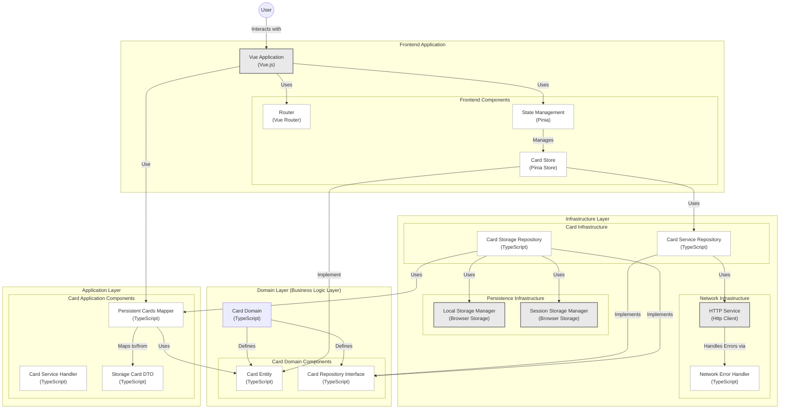

<div align="center">
  <a href="https://buymeacoffee.com/oscarraygoza">
    
  </a>

  <h1 align="center">CLEAN ARCHITECTURE FRONTEND</h1>

  <p align="center">
    A practical example implementing Clean Architecture principles in a Vue.js frontend application
    <br />
    <br />
    <a href="https://medium.com/@oscar.eduardo.raygoza/implementando-clean-architecture-en-el-frontend-una-experiencia-pr%C3%A1ctica-68d1dab575eb"><strong>Read the detailed guide »</strong></a>
    <br />
    <br />
    <a href="https://pokemontcgpoket.vercel.app/">View Demo</a>
    ·
    <a href="https://github.com/Oscar-Raygoza/clean-architecture--vue-3/issues">Report Bug</a>
    ·
    <a href="https://github.com/Oscar-Raygoza/clean-architecture--vue-3/issues">Request Feature</a>
  </p>
</div>

<br />

## 📋 Table of Contents

- [About the Project](#about-the-project)
- [Requirements](#requirements)
- [Getting Started](#getting-started)
  - [Environment Variables](#environment-variables)
  - [Installation](#installation)
  - [Available Scripts](#available-scripts)
- [Architecture](#architecture)
- [Built With](#built-with)
- [Contributing](#contributing)
- [License](#license)
- [Contact](#contact)

## 🔍 About the Project

This project demonstrates a practical implementation of Clean Architecture principles in a Vue.js frontend application. It showcases how to structure a frontend application with clear separation of concerns across different layers, making the codebase more maintainable, testable, and scalable.

The application uses the Pokémon TCG API to showcase these architectural concepts in a real-world scenario.

## ⚙️ Requirements

> [!IMPORTANT]
> Before starting, make sure you have the following installed to run the project in development mode.

- [Node.js](https://nodejs.org/en/download/package-manager) (v22.14.0 recommended)
- [Bun](https://bun.sh/) package manager

<details>
  <summary><b>Install Node.js on macOS 🍏</b></summary>
  
```bash
# Install nvm (Node Version Manager)
curl -o- https://raw.githubusercontent.com/nvm-sh/nvm/v0.40.0/install.sh | bash 

# Download and install Node.js (you may need to restart the terminal)
nvm install 22.14.0

# Verify Node.js installation
node -v # should print `v22.14.0`

# Verify npm installation
npm -v
```
</details>

<details>
  <summary><b>Install Node.js on Windows 🪟</b></summary>
  
```bash
# Install fnm (Fast Node Manager)
winget install Schniz.fnm

# Configure fnm environment
fnm env --use-on-cd | Out-String | Invoke-Expression

# Download and install Node.js
fnm use --install-if-missing 22.14.0

# Verify Node.js installation
node -v # should print `v22.14.0`
```
</details>

<details>
  <summary><b>Install Bun Package Manager</b></summary>
  
```bash
# For macOS, Linux, and WSL
curl -fsSL https://bun.sh/install | bash

# For Windows (via PowerShell)
powershell -c "irm bun.sh/install.ps1 | iex"

# Verify Bun installation
bun -v
```
</details>

<br />

## 🚀 Getting Started

Follow these steps to set up and run the project locally.

### Environment Variables

1. Create a `.env.local` file in the root directory based on the provided `.env.example`:

```bash
# .env.local

  ,-.       _,---._ __  / \
 /  )    .-'       `./ /   \      ~~~  Env Init ~~~
(  (   ,'            `/    /|
 \  `-"             \'\   / |     
  `.              ,  \ \ /  |     
   /`*          ,'-`----Y   |     
  (            ; .envs  |   '     
  |  ,-.    ,-'         |  /
  |  | (   |            | /
  )  |  \  `.___________|/
  `--'   `--'


VITE_POKEMONTCG_API_KEY=your_api_key_here
```

2. Generate an API key from [PokemonTCG Developer Portal](https://dev.pokemontcg.io/) and add it to your `.env.local` file.

<br />

### Installation

Install dependencies using Bun:

```bash
bun i
```

<br />

### Available Scripts

The project includes several useful scripts:

```bash
# Start development server
bun run dev

# Build for production
bun run build

# Preview production build
bun run preview

# Run end-to-end tests
bun run test:e2e

# Type checking
bun run type-check

# Linting
bun run lint         # Run all linters
bun run lint:oxlint  # Run oxlint only
bun run lint:eslint  # Run eslint only

# Code formatting
bun run format
```

After running `bun run dev`, the application will be available at:

```
http://localhost:5173/
```
<br />

## 🏗️ Architecture

This project follows Clean Architecture principles, organized into the following layers:



<br />

## 🛠️ Built With

<div>
  
  
  
  
  
  
</div>

<br />

## 🤝 Contributing

Contributions are what make the open source community such an amazing place to learn, inspire, and create. Any contributions you make are **greatly appreciated**.

1. Fork the Project
2. Create your Feature Branch (`git checkout -b feature/AmazingFeature`)
3. Commit your Changes (`git commit -m 'Add some AmazingFeature'`)
4. Push to the Branch (`git push origin feature/AmazingFeature`)
5. Open a Pull Request

<br />

## 📄 License

This project is licensed under the MIT License.

<br />

## 📬 Contact

Oscar Raygoza - [@oscar_raygoza](https://twitter.com/oscar_raygoza) - oscar.eduardo.raygoza@gmail.com

Project Link: [https://github.com/Oscar-Raygoza/clean-architecture--vue-3](https://github.com/Oscar-Raygoza/clean-architecture--vue-3)

---

<div align="center">
  <p>If you find this project helpful, please consider supporting:</p>
  <a href="https://buymeacoffee.com/oscarraygoza">
    
  </a>
</div>
